# Seizure Cluster Prototypes
- Individual clusters shown here, grouped by cluster type

# Up c-start 
7-supercluster 0
3-supercluster 0
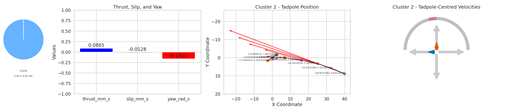

# Down c-start
7-supercluster 1
3-supercluster 0
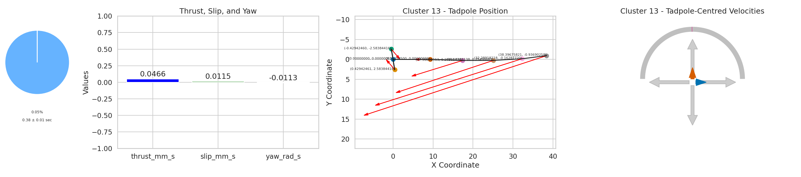

# Return from up c-start
7-supercluster 2
3-supercluster 1
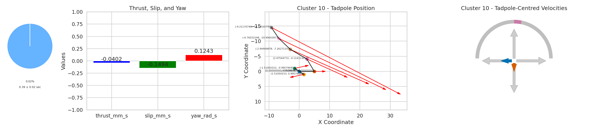

# Return from down c-start
7-supercluster 3
3-supercluster 1
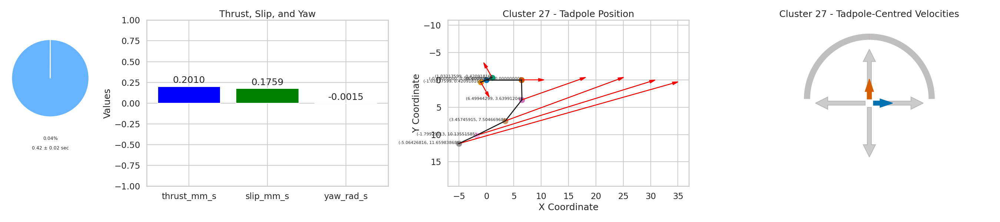

# Swipe down
7-supercluster 4
3-supercluster 2
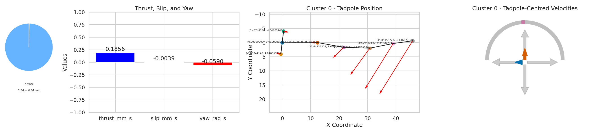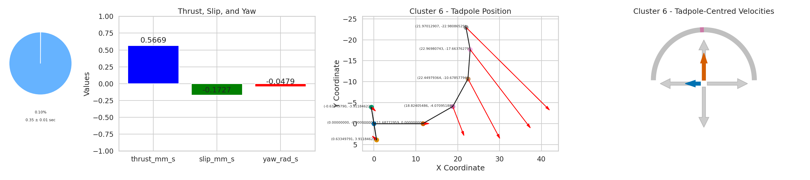 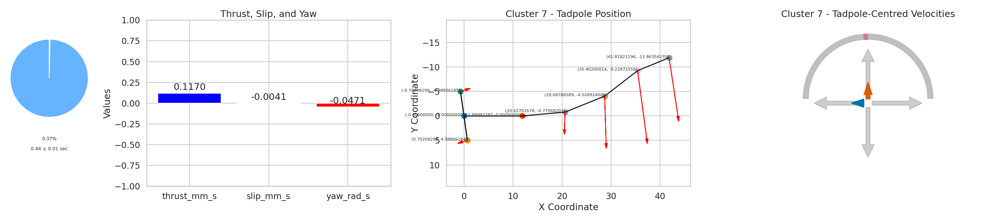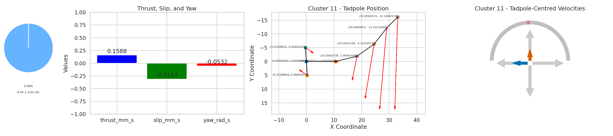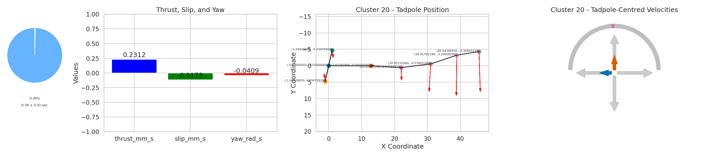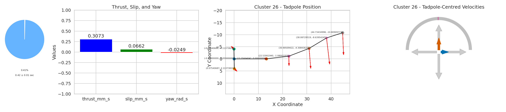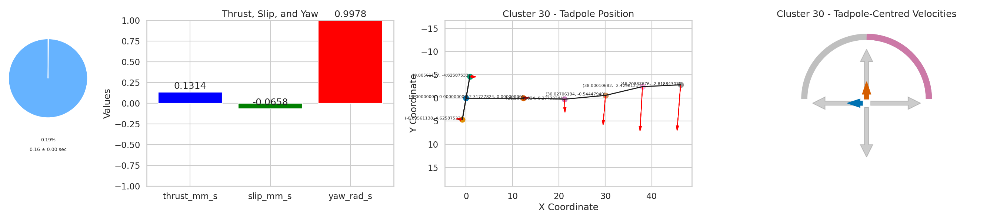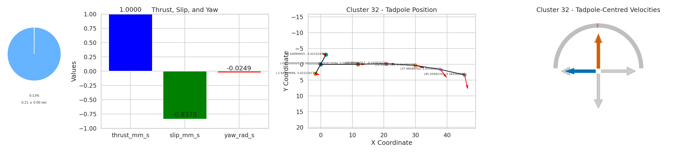

# Swipe down and forward
7-supercluster 5
3-supercluster 2

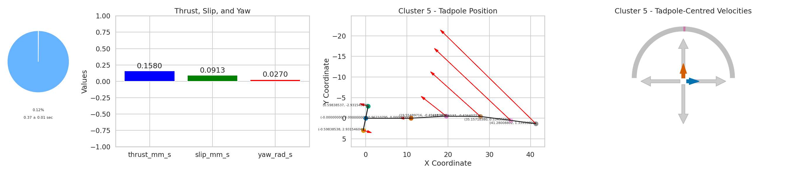

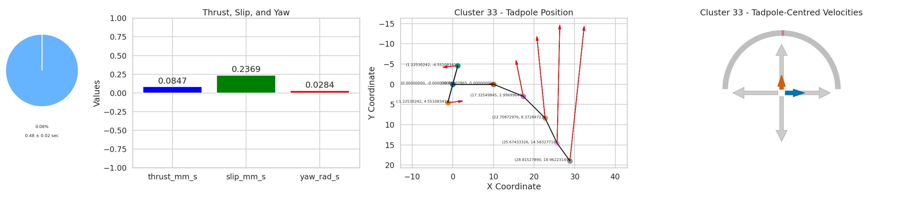

# Genral / up swish
7-supercluster 6
 3-supercluster 2
  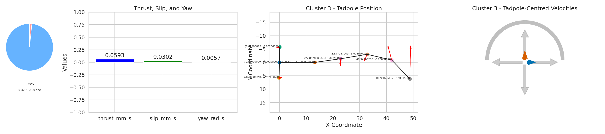 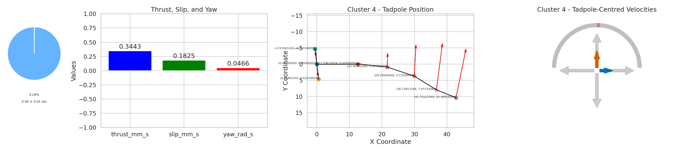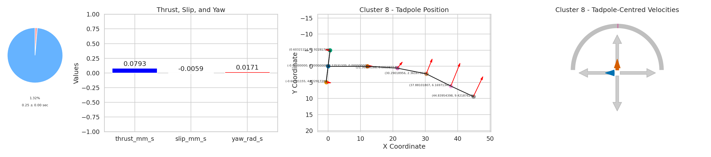 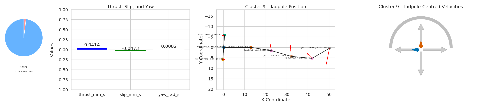 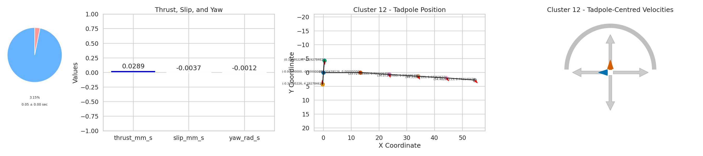 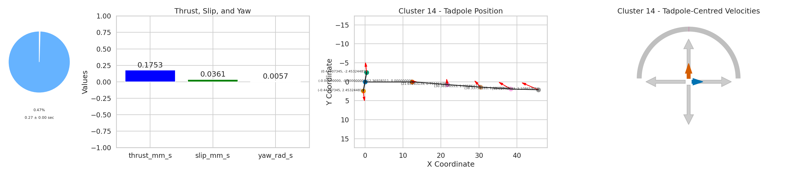 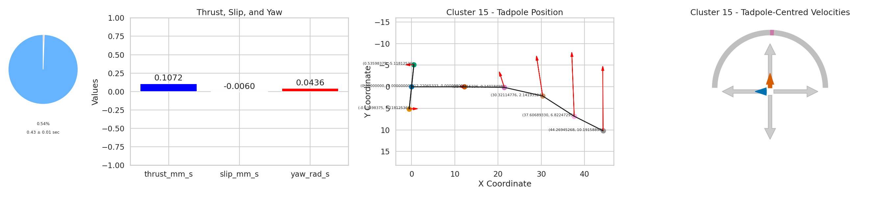 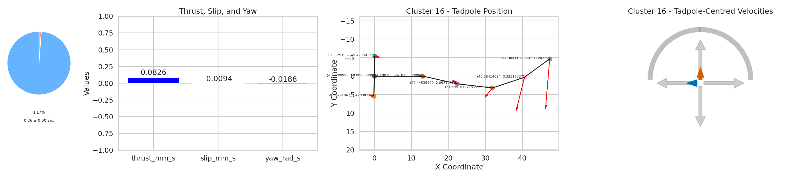 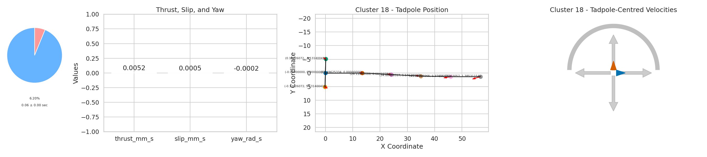 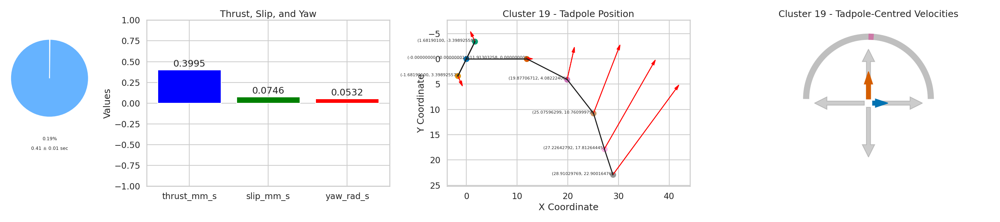 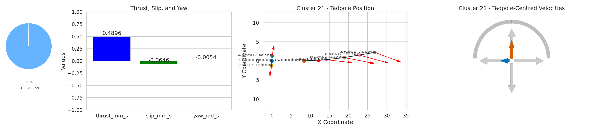 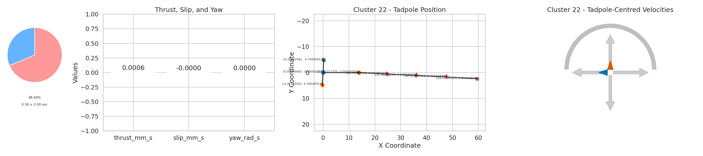 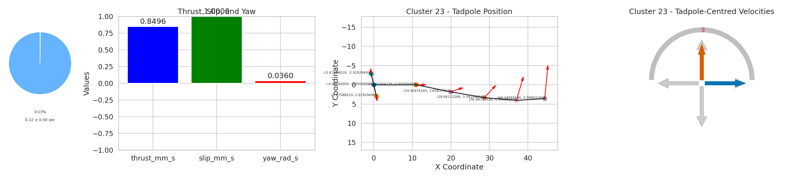  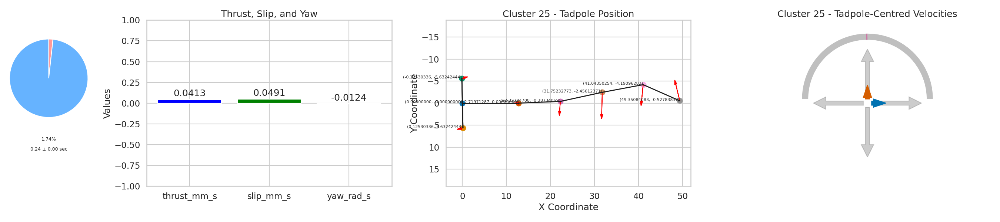 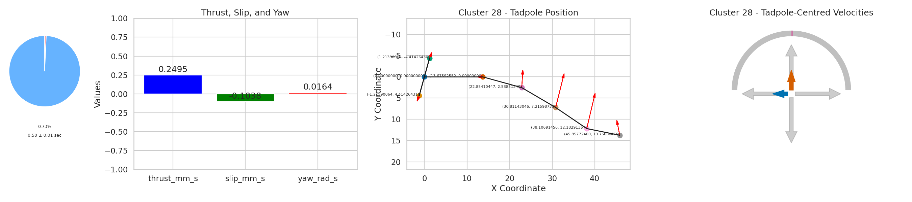 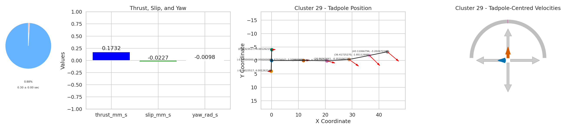 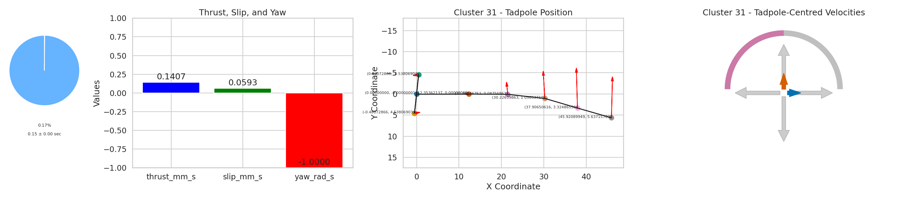 
